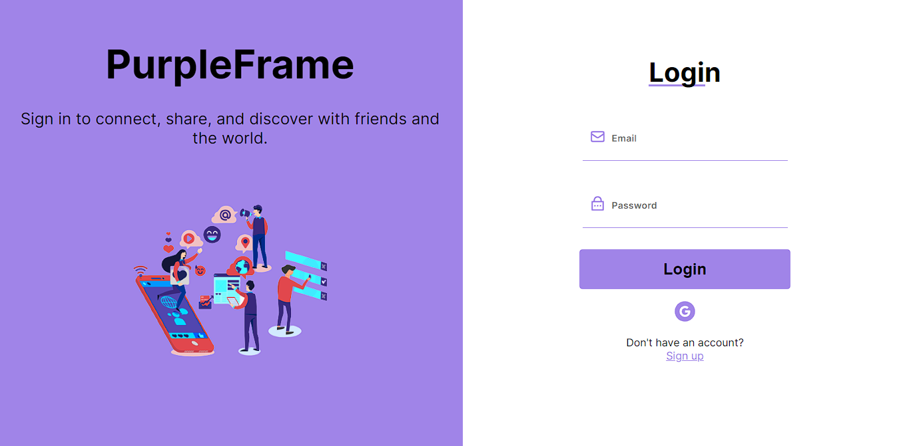

<h1 align="center"> PurpleFrame </h1>

 Rede social utilizando React e Firebase. 

    <a href="#sobre">sobre</a> •
    <a href="#tecnologias">tecnologias</a> •
    <a href="#autor">autor</a> 

<h4 align="center">🚧  This project is under construction . . .  🚧 </h4>

Você pode checar o projeto<a href="https://purpleframe.vercel.app/login"> clicando aqui.</a>

# Sobre

- A ideia do projeto é criar uma rede social utilizando o Google Firebase para criação e autenticação de usuários e banco de dados de posts.
 
# Tecnologias

As seguintes tecnologias foram usadas no projeto:

- <a href="https://developer.mozilla.org/pt-BR/docs/Web/HTML">HTML5</a>
- <a href="https://developer.mozilla.org/pt-BR/docs/Web/CSS">CSS3</a>
- <a href="https://www.typescriptlang.org/docs/">Typescript</a>
- <a href="https://react.dev/learn">React</a>
- <a href="https://firebase.google.com/docs?gad_source=1&gclid=Cj0KCQiAoKeuBhCoARIsAB4WxtclpHKoTweMGataW2gyVIL_grhTKlzp1XKcKIekIfYZUTwFdEnu4AUaApaoEALw_wcB&gclsrc=aw.ds&hl=pt">Firebase</a>

# Autor

Feito com 💜 por Thiago Henrique ✨<a href="https://www.linkedin.com/in/thiago-fid%C3%AAncio-a24578224/">Veja meu linkedin</a>
 
